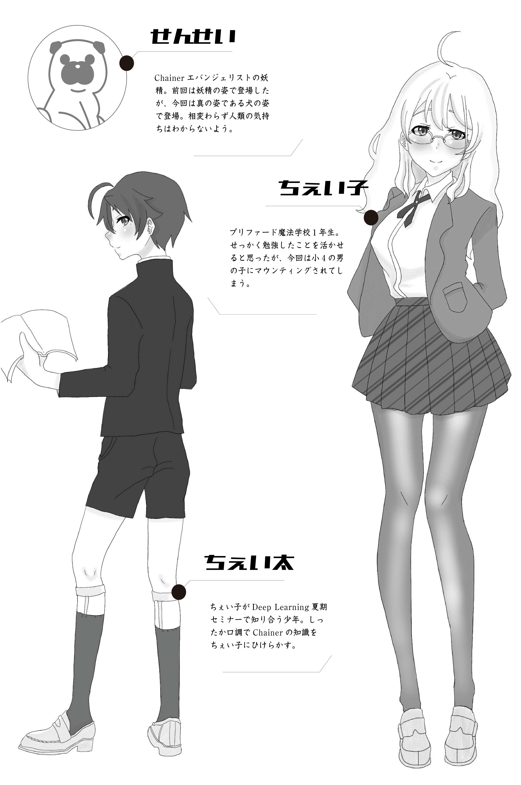

# プロローグ

//noindent

わたしの名前はちぇい子。
プリファード魔法学校に入学してから早くも半年がたち、夏休みを迎えています。
期末試験もそつなくこなし、履修登録した全ての単位を取得、いわゆる「フル単」。

//blankline
//noindent

@<icon>{cheiko} 「名門校でもこの程度なのかしら。思ったより楽勝ね！」

//blankline
//noindent

@<icon>{yousei} 「ちぇいこ〜、そんなこと言っていると後で痛い目見るよー。」

//blankline
//noindent

@<icon>{yousei} 「それに、Deep Learningのことはまだまだだしね。」

//blankline
//noindent

あいかわらず、この犬は私のことを腹立たしくさせてくる・・・

//blankline
//noindent

@<icon>{cheiko} 「そんなことないわよ。ここ半年で色々勉強したし、ほらこんな簡単にモデルの学習をすることができる！」

//blankline
//noindent

ちぇい子はカタカタとChainerのモデルを書き始める。

//blankline
//noindent

@<icon>{yousei} 「それはChainerが簡単に書けるからなんだけどね。」

//blankline
//noindent

空き教室でせんせいと勉強をしているといつもこんな感じ。
なんか半年経っても全く立場は変わらず、なめられているような気がする。
最近はくつろいでいるのか、妖精の姿でもなく、本来の犬の姿にもなっているようだし。

//blankline
//noindent

そんな折に、実はこんなイベントの募集を見つけたの。

「Deep Learning 夏期セミナー in 大岡山」！！！
なんとあのスパコンを使ってChainerをすることもできるそう。
今回はせんせいを出し抜いてDeep Learningの勉強をして、夏休み明けに
あっと言わせるつもり。

//blankline
//noindent

当日。
セミナー会場を訪れると、30人程度の人たちが講義形式で着席をしている。
私の席はなんと教室の一番前で、隣には小学生くらいの男の子が座っていた。
いったいこの子は何なんだろう、と思っていると講師の人が教室に入ってきた。

//blankline
//noindent

@<icon>{yousei} 「みなさん、今年もDeep Learning夏期セミナーに参加ありがとうございます。」

//blankline
//noindent

@<icon>{yousei} 「あれ、ちぇい子。君も参加しているんだね。よろしく。」

//blankline
//noindent

なんと、その場にいた講師はせんせいだった。

//blankline
//noindent

@<icon>{yousei} 「今回は２人１組で作業をすることもあるので、隣の席の人とグループを組んでもらいます。早速ですが隣同士、挨拶をしてみてください。」

//blankline
//noindent

わたしは隣の男の子に声をかけた。

//blankline
//noindent

@<icon>{cheiko} 「あれ、僕はなんていう名前？お父さんと一緒に来たのかなー？」

//blankline
//noindent

@<icon>{cheita} 「僕の名前はちぇい太です。それと、僕は参加者です。人を見かけで判断するのは良くないですよ。」

//blankline
//noindent

@<icon>{cheiko} 「あ、そうなのね！ごめんね。私の名前はちぇい子。一緒に頑張ろうね！」

//blankline
//noindent

すると、ちぇい太はこたえた。

//blankline
//noindent

@<icon>{cheita} 「Deep Learningは全部わかります。なので大丈夫です。」

//blankline
//noindent

ちぇい子の前にはせんせい、横には生意気なちぇい太。わたしはいったいどうなっちゃうのー！！！

