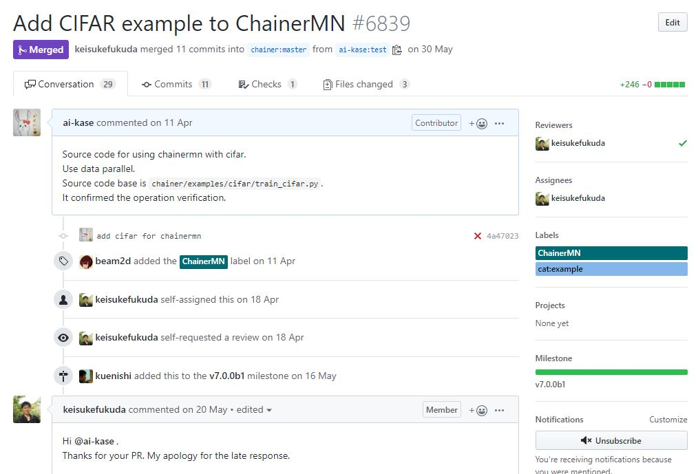
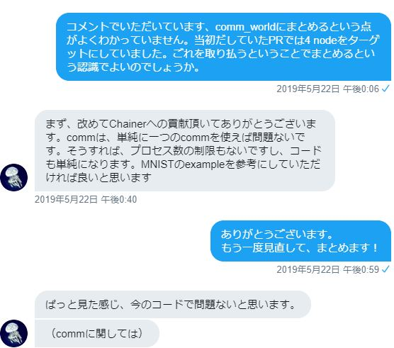
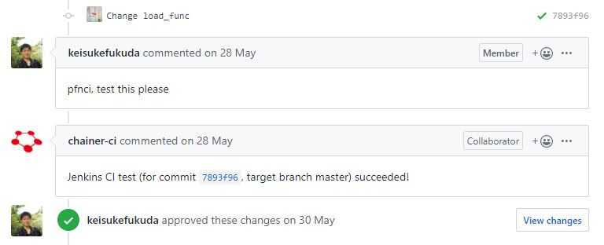
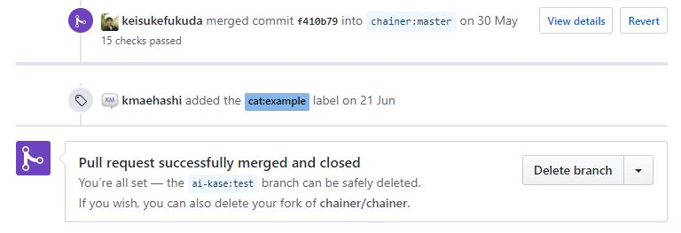
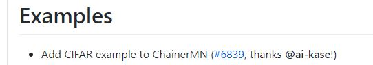

# Chainerにコントリビュート！

@<icon>{cheiko} 「CIFARの画像データを使って、Chainerのサンプルコードを書き換えて...!できた！ChainerMN用のCIFARデータセットを使った学習プログラム！」   

//blankline
//noindent

ちぇい子は作った学習プログラムの動作確認をした。

//blankline
//noindent

@<icon>{cheiko} 「よしよし、動作した。このプログラム、Chainerを使っている別の人にも気軽に使ってもらえたらいいのになぁ。」

@<icon>{cheita} 「出来ますよ！Chainerを使っているのにそんなことも知らないのですか？」

@<icon>{cheiko} 「えっ...(ちぇい太くんは本当に色々と知っているな、最近の小学生はすごい。)」

@<icon>{cheita} 「「ChainerはOSSだから、Githubから誰でもプルリクが出来るんです！」

@<icon>{cheiko} 「プルリク...？」

@<icon>{yousei} 「そうそう、ちぇい太君の言う通り、追加してほしい機能やプログラム、バグ修正などをPull requestやIssueにしてChainer開発者に要望をだすことが出来るんだよ。」

@<icon>{cheiko} 「そんなことが出来るんだ～。でも、プルリクってハードルが高そう...」

@<icon>{cheita} 使っているChainerに貢献できるんですよ？それにセミナーの成果をみせて下さい。はやく、プルリクしますよ！」

//blankline
//noindent

ちぇい太にせかされながら、「セミナーの成果」と言われたら、このままでは終われない。と、ちぇい子はプルリクをするためにChainerをGithubからForkした。

 //blankline

--

//blankline

この章は、MNIST以外で公開されているデータセットと学習プログラムで  
ChainerMN[^11] を使って学習したい。という気持ちから作成した学習プログラムをChainerにプルリクした体験談です。  
[^11]: https://github.com/chainer/chainermn
 

## Pull Requestを提出
今回、私がプルリクした学習プログラムはChainerMNでCIFARを学習するものでした。  

//blankline

### プログラムを作成したキッカケ

このプログラムを作成したキッカケについて少し触れさせてください。  
ChainerMNを試したいと思い `chainer/examples/chainermn` を探したところ、当時(2018年12月頃)、画像分類系はMNISTとImageNetのサンプルコードがありました。  
お手軽にお試しできるのはMNISTだけど、「分散」深層学習には味気ないし、ImageNetは画像データを用意しないといけないからお手軽じゃない。  
...CIFARのサンプルコードほしいな。というキッカケで`chainer/examples/cifar` のサンプルコードを元に作成しました。

### Pull requestをしたキッカケ

作成したプログラムは手元に置いておき、Chainer側からサンプルコードがリリースされるのを待っていました。が！3ヵ月ぐらい待ってもリリースがなかったので、自分の作成したプログラムをマージしてもらおうと、おそるおそるプルリクをしました(笑)  

実際にプルリクした内容はこちら。

## Reviwerとやり取り

@<icon>{cheiko} 「プルリクしたけど、その後どうすればいいの？」

@<icon>{cheita} 「本当にプルリクしたんですね。とりあえず、プルリクをレビューしてくれるReviwerを待つことです。」

@<icon>{yousei} 「Reviwerを待つ間に、コミットしたものに"×"ってついているからエラー内容を確認してわかる範囲で修正しておくといいよ。」

//blankline

プルリクをするとChainer開発者側からカテゴリーラベルがつけられました。そして、Reviwerがアサインしてくれました。  
今回、レビューを担当してくださった方は、Fukudaさん[^12]でした。  
[^12]: FukudaさんのGithub->https://github.com/keisukefukuda

レビュワーと、レビュー内容に対してコメントやプログラムの修正を何度もやり取りをしました。  
やり取りをしていく中で、Twitterで日本語で対応するよ！と言っていただきました。 お言葉に甘えて、TwitterのDMで日本語でやり取りをしました。  
分かっていなかったことは丁寧に教えてくださいました。

  
※掲載許可頂きました  
  

//blankline

Githubでは、全て英語でやり取りをしなければならないですよね。プルリクのハードルが高い理由の一つでした。私の場合、英語は翻訳先生にほとんど頼んでいたため、日本語でやり取りできたのはとても嬉しく、心強かったです。   

//noindent

全てのレビュワーが日本語で対応してくれるかどうかはわかりませんが、レビュワーが日本人というだけで、少し心に余裕ができ、プルリクしてみようかなという気持ちになるのではないでしょうか。

//blankline
//noindent

@<icon>{cheita} 「「Chainerは日本発のフレームワークなので、日本人の開発者がいます。これは日本人にとって、とっても嬉しいですよね。」

@<icon>{cheiko} 「確かに♪ 心強い！Chainerにプルリクするハードルって他のフレームワークに比べて高くないのかも？」

## Contributerデビュー

エラーがなくなり、コミットが"〇"になったらレビュワーがchainer-ciにtestを要求し、successedが返ってきたらコントリビュートまで秒読みです。  

//noindent

//blankline
//noindent

レビュワーに最終チェックをしてもらい、ChainerのmasterブランチにMargeしてもらうとコントリビュート完了です。   

//blankline
//noindent

  

//blankline
//noindent

更に、割り当てられたマイルストーンがリリースするとリリースノートにプルリクの内容が書かれ、名前も載りました。
名前まで載ると嬉しかったです。自分の財産になりました。

//blankline
//noindent

//blankline

プルリクを提出してから、実際にMargeされるまで約1ヵ月半かかりました。  
※レビュワーとやり取りを開始してからは半月ぐらいでした。    
ChainerMNで画像分類を試してみたい時、よかったら使ってみてくださると嬉しいです。[^13]   
[^13]: https://github.com/chainer/chainer/tree/master/examples/chainermn/cifar

//blankline
//noindent

@<icon>{cheita} 「一度でもコントリビュートすると、コントリビューターデビューです。」

@<icon>{cheiko} 私が、Chainerのコントリビューターに...！セミナーの成果がこんな形になるなんて思わなかった。」

 @<icon>{cheita} 「やればできるんですね。」

@<icon>{cheiko} 「ちぇい太君、私のことみなおした？」

@<icon>{cheita} 「まだまだです。あとコントリビュート100回ぐらいしたらみなしてあげます。」

//blankline
//noindent

ちぇい子がちぇい太に認められるにはまだ先のようだ。

## コントリビュートのススメ

使っているフレームワークに自分のプルリクがMargeされると嬉しいですよね。  

//noindent

新しい機能や拡張、バク修正だけでなく  
簡単にChainerを試せるサンプルプログラムのバリエーションを増やすコントリビュートの形はいかがでしょうか。    
例えば、こんなサンプルプログラムがあったら嬉しいと個人的に思っています。  
- ChainerでCIFARのData parallel のプログラム

//noindent

また、プログラム動かない、分からない、どうすればいいの。という時は、ChainerのSlack[^14]に質問してみてはいかがでしょうか。
[^14]: Slackへの参加はこちらhttps://bit.ly/chainer-jp-slack   
Chaienr関係者や詳しい方々が答えてくれます！(日本語で対応してくれます、しかもレスポンス早め(有難い))    
Chainerチュートリアルの質問チャンネルもあります。
    
コントリビュートする形は様々です。  
Chainerにコントリビュートして、利用者からコントリビューターになって一緒に名前を刻みませんか！  
この章を読んで、コントリビュートしてみようかなと思ってくれたら嬉しいです。

//blankline
//noindent

@<icon>{yousei} 「Chainerにコントリビュート待ってるワン！」
